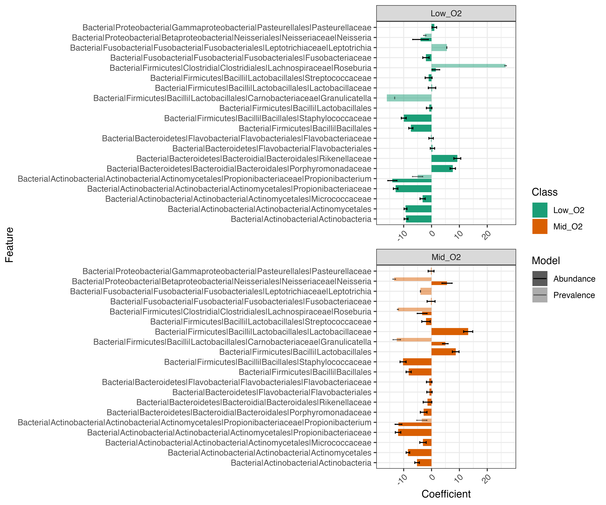
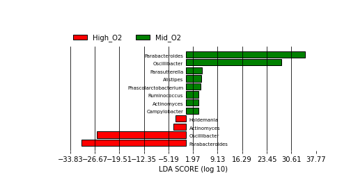
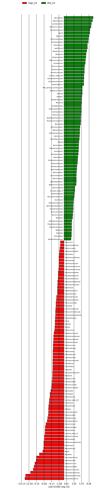
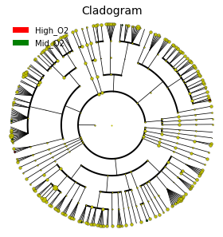
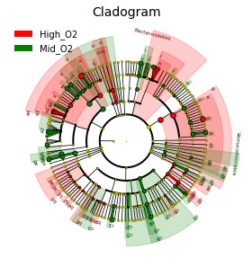

## Usage: 

#### STEP 1: Generate lefse like results using maaslin3
```
Rscript maaslin3_lite.R    \
 --input hmp_aerobiosis_small.txt   \
 --normalize FALSE    \
 --class oxygen_availability   \
 --subclass body_site  \   
 --random_component subject_id    \ 
 --alpha_threshold 0.1
```

#### Output 
```
lefse_style_results_abundance.res
lefse_style_results_prevalence.res
all_results.tsv
```
### Summary Plots 


#### STEP2:  Generating lefse like plots 
```
lefse_plot_res.py lefse_style_results_prevalence.res hmp_prevalance_aerobiosis_small.png
```
<!--  -->

```
lefse_plot_res.py lefse_style_results_abundance.res hmp_abundance_aerobiosis_small.png
```
<!--  -->

#### STEP3:  Generating lefse like cladogram 
```
lefse_plot_cladogram.py lefse_style_results_prevalence.res hmp_prevalence_aerobiosis_small.cladogram.png --format png
```
<!--  -->

```
lefse_plot_cladogram.py lefse_style_results_abundance.res hmp_abundance_aerobiosis_small.cladogram.png --format png
```
<!--  -->
